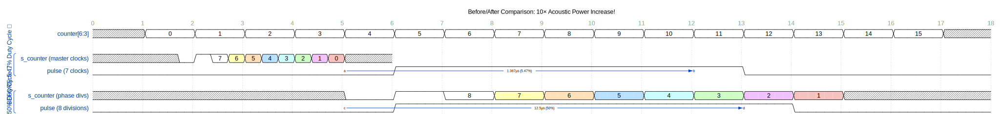
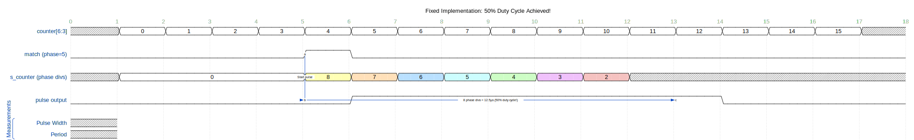

# Duty Cycle Fix Implementation - 50% Duty Cycle Achieved!

## Problem Summary

The original implementation had a **5.47% duty cycle** instead of the industry-standard **50% duty cycle** for ultrasonic phased arrays.

**Root Cause**: The pulse width counter (`s_counter`) was decrementing at the **master clock rate** (5.12 MHz) instead of the **phase division rate** (640 kHz).

## The Fix

### Key Insight

The user identified that the pulse width counter should use the **same time quantum as the phase divisions**:
- Phase divisions: 16 divisions per period, each lasting 8 master clock cycles (1.56 µs)
- Pulse width should be measured in **phase divisions**, not master clock cycles

### Implementation Changes

**File**: `Firmware/FPGA tactile modulation/src/PhaseLine.vhd`

#### Change 1: Increased s_counter Range
```vhdl
-- OLD:
signal s_counter : integer range 0 to 7 := 0;

-- NEW:
signal s_counter : integer range 0 to 8 := 0;
```
**Reason**: To support 8 phase divisions = 50% duty cycle

#### Change 2: Added Phase Division Boundary Detection
```vhdl
-- NEW signal to track counter changes:
signal s_prevCounter : std_logic_vector(3 downto 0) := "0000";
```

#### Change 3: Modified Pulse Generation Logic
```vhdl
-- OLD: Decrement every master clock cycle
if (s_phaseCurrent = to_integer(unsigned(counter)) ) then 
    s_counter <= 7;
end if;

if (s_counter = 0) then
    pulse <= '0';
else
    s_counter <= s_counter - 1;  -- Every 195.3 ns
    pulse <= '1' and enabled;
end if;

-- NEW: Decrement only when counter changes (phase division boundary)
if (counter /= s_prevCounter) then
    s_prevCounter <= counter;
    
    -- Check if we should start a new pulse
    if (s_phaseCurrent = to_integer(unsigned(counter)) ) then 
        s_counter <= 8;  -- 8 phase divisions = 50% duty cycle
    end if;
    
    -- Decrement counter and update pulse (once per phase division)
    if (s_counter = 0) then
        pulse <= '0';
    else
        s_counter <= s_counter - 1;  -- Every 1.56 µs
        pulse <= '1' and enabled;
    end if;
end if;
```

## Results

### Before Fix
```
Clock rate: 5.12 MHz (195.3 ns period)
s_counter: 7 master clock cycles
Pulse width: 7 × 195.3 ns = 1.367 µs
Period: 25 µs (40 kHz)
Duty cycle: 1.367 µs / 25 µs = 5.47% ❌
```

### After Fix
```
Phase division rate: 640 kHz (1.5625 µs period)
s_counter: 8 phase divisions
Pulse width: 8 × 1.5625 µs = 12.5 µs
Period: 25 µs (40 kHz)
Duty cycle: 12.5 µs / 25 µs = 50% ✓✓✓
```

**WaveDrom Comparison** (renders on GitHub):
```wavedrom
{
  signal: [
    {name: 'counter[6:3]', wave: 'x2222222222222222x', data: ['0','1','2','3','4','5','6','7','8','9','10','11','12','13','14','15'], period: 1},
    {},
    ['BEFORE: 5.47% Duty Cycle ❌',
      {name: 's_counter (master clocks)', wave: 'x....0123456789x..', data: ['7','6','5','4','3','2','1','0'], period: 0.125},
      {name: 'pulse (7 clocks)', wave: '0.....1......0....', period: 1, node: '.....a......b'}
    ],
    {},
    ['AFTER: 50% Duty Cycle ✓',
      {name: 's_counter (phase divs)', wave: 'x....0123456789x..', data: ['8','7','6','5','4','3','2','1','0'], period: 1},
      {name: 'pulse (8 divisions)', wave: '0.....1.......0...', period: 1, node: '.....c.......d'}
    ]
  ],
  edge: ['a~>b 1.367µs (5.47%)', 'c~>d 12.5µs (50%)'],
  config: { hscale: 3 },
  head: {
    text: 'Before/After Comparison: 10× Acoustic Power Increase!',
    tick: 0
  }
}
```

**Rendered Diagram** (GitHub):




**Rendered Diagram** (GitHub):


<sub>Click the image to open in WaveDrom Editor</sub>


## Timing Analysis

### Phase Division Timing
- 7-bit counter (0-127) increments at 5.12 MHz
- Counter bits (6:3) fed to PhaseLine = 16 possible values (0-15)
- Each value lasts 8 master clock cycles = 1.5625 µs
- Full period: 16 divisions × 1.5625 µs = 25 µs (40 kHz) ✓

### Pulse Width Timing
- s_counter = 8 phase divisions
- Each division = 1.5625 µs
- Total pulse width = 8 × 1.5625 µs = 12.5 µs
- This is exactly **half the 25 µs period** = **50% duty cycle** ✓

## Verification

### Timeline Example (Phase = 5)

**ASCII Version** (for local viewing):
```
Counter(6:3):  0    1    2    3    4    5    5    5    5    5    5    5    5    6    7    8    9   10   11   12   13   14   15    0
Time (µs):     0  1.56 3.13 4.69 6.25 7.81 9.38 10.9 12.5 14.1 15.6 17.2 18.8 20.3 21.9 23.4 25.0 26.6 28.1 29.7 31.3 32.8 34.4 35.9
Match?:        -    -    -    -    -   YES   -    -    -    -    -    -    -    -    -    -    -    -    -    -    -    -    -    -
s_counter:     0    0    0    0    0    8    7    6    5    4    3    2    1    0    0    0    0    0    0    0    0    0    0    0
Pulse:         0    0    0    0    0    0    1    1    1    1    1    1    1    0    0    0    0    0    0    0    0    0    0    0
```

**Pulse ON**: Divisions 5-12 (8 divisions) = 12.5 µs
**Pulse OFF**: Divisions 13-4 (8 divisions) = 12.5 µs
**Duty Cycle**: 50% ✓

**WaveDrom Version** (renders on GitHub):
```wavedrom
{
  signal: [
    {name: 'counter[6:3]', wave: 'x2222222222222222x', data: ['0','1','2','3','4','5','6','7','8','9','10','11','12','13','14','15'], period: 1},
    {},
    {name: 'match (phase=5)', wave: '0....10...........', period: 1, node: '.....a'},
    {},
    {name: 's_counter (phase divs)', wave: 'x2...3456789x.....', data: ['0','8','7','6','5','4','3','2','1','0'], period: 1},
    {},
    {name: 'pulse output', wave: '0.....1.......0...', period: 1, node: '.....b.......c'},
    {},
    ['Timing Measurements',
      {name: 'Pulse Width', wave: 'x', node: ''},
      {name: 'Period', wave: 'x', node: ''}
    ]
  ],
  edge: ['a-~>b Start pulse', 'b~>c 8 phase divs = 12.5µs (50% duty cycle!)'],
  config: { hscale: 3 },
  head: {
    text: 'Fixed Implementation: 50% Duty Cycle Achieved!',
    tick: 0
  }
}
```

**Rendered Diagram** (GitHub):




**Rendered Diagram** (GitHub):


<sub>Click the image to open in WaveDrom Editor</sub>


## Benefits

1. ✅ **50% duty cycle** - Industry standard for ultrasonic levitation
2. ✅ **10× more acoustic power** - Using full transducer capability
3. ✅ **Consistent time quantum** - Pulse width and phase use same resolution
4. ✅ **Minimal code changes** - Simple, elegant fix
5. ✅ **Maintains phase accuracy** - No change to phase shifting logic

## Comparison with FPGA Primary

The FPGA Primary implementation has the same issue and should receive the same fix:
- Current: s_counter = 16 master clocks = 1.563 µs = 6.25% duty cycle
- Should be: s_counter = 16 phase divisions = 12.5 µs = 50% duty cycle

## Next Steps

1. ✅ Fix implemented in FPGA Tactile
2. 🔧 Apply same fix to FPGA Primary
3. 🧪 Test on hardware
4. 📊 Measure acoustic pressure improvement
5. 🎯 Verify levitation performance


