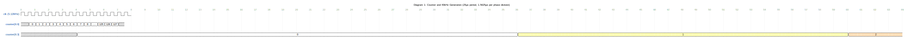
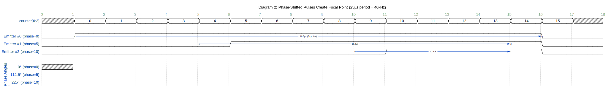
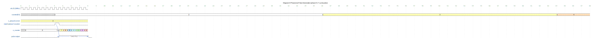
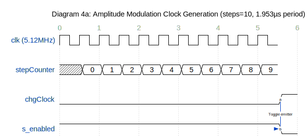
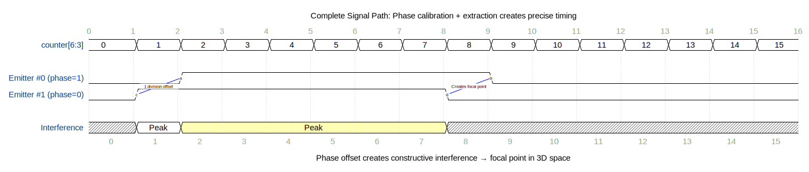
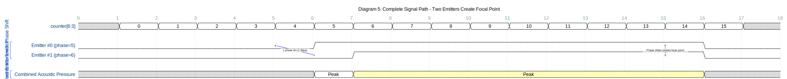

# Phase Signal Path Documentation: Java to FPGA to Emitters

This document explains the complete signal path from Java software to ultrasonic emitters, including phase delays, timing, and modulation.

---

## Table of Contents
1. [System Overview](#system-overview)
2. [Clock Generation](#clock-generation)
3. [Phase Data Flow](#phase-data-flow)
4. [Temporal Signal Generation](#temporal-signal-generation)
5. [Amplitude Modulation](#amplitude-modulation)
6. [Timing Diagrams](#timing-diagrams)

---

## 1. System Overview

### Signal Path Summary
```
Java Application
    ↓ (UART/Serial)
UARTReader (FPGA)
    ↓
Distribute Module
    ↓ (Phase + Calibration)
AllChannels Module
    ↓
PhaseLine (×256 instances)
    ↓
Mux8 (×32 instances)
    ↓
32 Output Pins → Ultrasonic Emitters (40 kHz)
```

### Key Parameters
- **Ultrasonic Frequency**: 40 kHz (25 µs period)
- **Phase Divisions**: 16 (0-15)
- **Phase Resolution**: 25 µs / 16 = **1.5625 µs per division**
- **Number of Emitters**: 256
- **Output Channels**: 32 (8:1 multiplexing)
- **Modulation Frequency**: Configurable (typically 50-200 Hz for tactile feedback)

---

## 2. Clock Generation

### Master Clock (Masterclock.vhd)
```
Input Clock:  50 MHz (from crystal oscillator)
PLL Configuration:
  - Divide by: 625
  - Multiply by: 64
  - Output: 50 MHz × (64/625) = 5.12 MHz

Main Clock (clk): 5.12 MHz
  - Period: 195.3 ns
  - Used for: Counter, phase logic, all synchronous operations
```

### Counter Generation (Counter.vhd)
```vhdl
-- 7-bit counter: 0 to 127
signal sCounter : STD_LOGIC_VECTOR (6 downto 0);

-- Increments on every clk rising edge
-- Wraps around: 0 → 1 → 2 → ... → 127 → 0
```

**Counter Timing**:
- Increment rate: 5.12 MHz
- Full cycle (0-127): 128 / 5.12 MHz = **25 µs** (40 kHz period) ✓
- Counter bits used for phase: `counter(6:3)` = 4 bits (0-15)
- Counter bits used for mux: `counter(2:0)` = 3 bits (0-7)

---

## 3. Phase Data Flow

### Step 1: Java Calculates Phase (SimpleFPGA_Tactile.java)
```java
// For each transducer
int phase = t.getDiscPhase(16);  // 16 divisions: 0-15
int PHASE_OFF = 16;              // Value 16 means "OFF"

// If amplitude is 0, send OFF command
if (t.getpAmplitude() == 0) {
    phase = PHASE_OFF;  // Send 16 (0x10)
}

// Send via UART
phaseDataPlusHeader[0] = 254;    // Start command (0xFE)
phaseDataPlusHeader[1..256] = phase values for each emitter
serial.write(phaseDataPlusHeader);
```

### Step 2: FPGA Receives Data (UARTReader.vhd)
```
UART Settings:
  - Baud rate: 115200
  - Data bits: 8
  - Stop bits: 1
  - Parity: None

Receives byte stream:
  [254] [phase0] [phase1] [phase2] ... [phase255]
```

### Step 3: Distribute Module Applies Calibration (Distribute.vhd)
```vhdl
-- Receive phase value from Java (0-15 for ON, 32 for OFF)
if (q_in = "00100000") then  -- 32 = OFF
    s_data_out <= q_in;      -- Pass through unchanged
else
    -- Add phase calibration and mask to 5 bits (0-31)
    s_data_out <= (q_in + PHASE_CORRECTION(emitter_index)) and "00011111";
end if;
```

**Phase Calibration Array** (divided by 2 for 16-division system):
```vhdl
PHASE_CORRECTION : array(0 to 255) of integer range 0 to 16
  = (11,5,6,5,13,14,13,13,5,6,6,13,14,5,6,6,...)
```

**Example Calculation**:
```
Java sends:     phase = 8 (for emitter #0)
Calibration:    PHASE_CORRECTION(0) = 11
FPGA calculates: (8 + 11) and 0x1F = 19 and 31 = 19
Final phase:    19 (5-bit value)
```

### Step 4: AllChannels Distributes to PhaseLine (AllChannels.vhd)
```vhdl
-- Extract 5 bits for phase (bits 5:1)
phase_to_phaseline <= phase(5 downto 1);  -- 5 bits: 0-31

-- Extract 4 bits for counter (bits 6:3)
counter_to_phaseline <= counter(6 downto 3);  -- 4 bits: 0-15
```

**Bit Extraction**:
```
phase input:    [7][6][5][4][3][2][1][0]
                      └─────┬─────┘
                    Used: bits 5:1 (5 bits)

counter input:  [6][5][4][3][2][1][0]
                   └───┬───┘

```
**ASCII Version** (for local viewing):
```
Master Clock (5.12 MHz):
    ___   ___   ___   ___   ___   ___   ___   ___
___|   |_|   |_|   |_|   |_|   |_|   |_|   |_|   |___
   195ns  195ns  195ns  195ns  195ns  195ns  195ns

7-bit Counter (0-127):
Value: 0   1   2   3   4   5   6   7   8   9  ...  127  0   1
       ├───┴───┴───┴───┴───┴───┴───┴───┴───┴───...───┴───┤
       └──────────────── 25 µs (40 kHz period) ──────────┘

4-bit Counter (bits 6:3, used for phase comparison):
Value: 0   0   0   0   0   0   0   0   1   1   1   1   1   1   1   1   2
       ├───────────────────────────────┴───────────────────────────────┤
       └──────────── 1.5625 µs per division ────────────┘
```

**WaveDrom Version** (renders on GitHub):
```wavedrom
{
  signal: [
    {name: 'clk (5.12MHz)', wave: 'p...............', period: 0.5},
    {},
    {name: 'counter[6:0]', wave: 'x2222222222222x', data: ['0','1','2','3','4','5','6','7','8','...','125','126','127','0'], period: 0.5},
    {},
    {name: 'counter[6:3]', wave: 'x2.......3.....4', data: ['0','1','2'], period: 4}
  ],
  config: { hscale: 2 },
  head: {
    text: 'Diagram 1: Counter and 40kHz Generation (25µs period, 1.5625µs per phase division)',
    tick: 0
  }
}
```

**Rendered Diagram** (GitHub):



<sub>Click the image to open in WaveDrom Editor</sub>


### Diagram 2: Phase-Shifted Pulse Generation

**ASCII Version** (for local viewing):
```
Example: 3 emitters with different phases

Counter(6:3):  0   1   2   3   4   5   6   7   8   9  10  11  12  13  14  15
               ├───┴───┴───┴───┴───┴───┴───┴───┴───┴───┴───┴───┴───┴───┴───┤
               └──────────────────── 25 µs (40 kHz) ──────────────────────┘

Emitter #0 (phase=0):
Pulse:         ████████████████░░░░░░░░░░░░░░░░░░░░░░░░░░░░░░░░░░░░░░░░░░░░
               └─ 10.9 µs ─┘

Emitter #1 (phase=5):
Pulse:         ░░░░░░░░░░░░░░░░░░░░░░░░████████████████░░░░░░░░░░░░░░░░░░░░
                                       └─ 10.9 µs ─┘

Emitter #2 (phase=10):
Pulse:         ░░░░░░░░░░░░░░░░░░░░░░░░░░░░░░░░░░░░░░░░░░░░████████████████
                                                           └─ 10.9 µs ─┘

Physical Result:
  - Emitter #0 starts at 0°
  - Emitter #1 starts at 112.5° (5/16 × 360°)
  - Emitter #2 starts at 225° (10/16 × 360°)
  → Creates constructive/destructive interference → Focal point!
```

**WaveDrom Version** (renders on GitHub):
```wavedrom
{
  signal: [
    {name: 'counter[6:3]', wave: 'x2222222222222222x', data: ['0','1','2','3','4','5','6','7','8','9','10','11','12','13','14','15'], period: 1},
    {},
    {name: 'Emitter #0 (phase=0)', wave: '01..............0.', period: 1, node: '.a..............b'},
    {name: 'Emitter #1 (phase=5)', wave: '0.....1.........0.', period: 1, node: '.....c.........d'},
    {name: 'Emitter #2 (phase=10)', wave: '0..........1....0.', period: 1, node: '..........e....f'},
    {},
    ['Phase Angles',
      {name: '0° (phase=0)', wave: 'x', phase: 0},
      {name: '112.5° (phase=5)', wave: 'x', phase: 112.5},
      {name: '225° (phase=10)', wave: 'x', phase: 225}
    ]
  ],
  edge: ['a~>b 10.9µs (7 cycles)', 'c~>d 10.9µs', 'e~>f 10.9µs'],
  config: { hscale: 3 },
  head: {
    text: 'Diagram 2: Phase-Shifted Pulses Create Focal Point (25µs period = 40kHz)',
    tick: 0
  }
}
```

**Rendered Diagram** (GitHub):



<sub>Click the image to open in WaveDrom Editor</sub>


### Diagram 3: Detailed PhaseLine Operation

**ASCII Version** (for local viewing):
```
Example: Emitter with phase = 3

Master Clock (5.12 MHz):
    ___   ___   ___   ___   ___   ___   ___   ___   ___   ___
___|   |_|   |_|   |_|   |_|   |_|   |_|   |_|   |_|   |_|   |___

Counter(6:3):  2       2       2       3       3       3       3
               ├───────────────────────┼───────────────────────┤

s_phaseCurrent: 3 (stored value)

Comparison (phase = counter):
               FALSE   FALSE   FALSE   TRUE!   FALSE   FALSE   FALSE

s_counter:     0       0       0       7       6       5       4
               ├───────────────────────┼───────┼───────┼───────┤

Pulse Output:  0       0       0       1       1       1       1
               ░░░░░░░░░░░░░░░░░░░░░░░░████████████████████████
                                       └──── Pulse starts when counter=phase ────┘

Continues for 7 clock cycles:
Counter(6:3):  3   3   3   3   3   3   3   3   4   4   4   4
s_counter:     7   6   5   4   3   2   1   0   0   0   0   0
Pulse:         1   1   1   1   1   1   1   0   0   0   0   0
               ████████████████████████████░░░░░░░░░░░░░░░░░░░░
               └────── 7 cycles ──────┘
```

**WaveDrom Version** (renders on GitHub):
```wavedrom
{
  signal: [
    {name: 'clk (5.12MHz)', wave: 'p...............', period: 0.5},
    {},
    {name: 'counter[6:3]', wave: 'x2.......3......4', data: ['2','3','4'], period: 4},
    {},
    {name: 's_phaseCurrent', wave: '3...............', data: ['3'], period: 0.5},
    {name: 'match (phase=counter)', wave: '0.......10......', period: 0.5, node: '........a'},
    {},
    {name: 's_counter', wave: 'x2.......3456789', data: ['0','7','6','5','4','3','2','1','0'], period: 0.5},
    {},
    {name: 'pulse output', wave: '0........1......0', period: 0.5, node: '.........b......c'}
  ],
  edge: ['a-~>b Trigger', 'b~>c 7 clocks (1.367µs)'],
  config: { hscale: 2 },
  head: {
    text: 'Diagram 3: PhaseLine Pulse Generation (phase=3, 7-cycle pulse)',
    tick: 0
  }
}
```

**Rendered Diagram** (GitHub):



<sub>Click the image to open in WaveDrom Editor</sub>


### Diagram 4: Amplitude Modulation for Tactile Feedback

**ASCII Version** (for local viewing):
```
Example: Modulation with steps = 10, targeting 100 Hz tactile sensation

Master Clock (5.12 MHz):
    ___   ___   ___   ___   ___   ___   ___   ___   ___   ___   ___
___|   |_|   |_|   |_|   |_|   |_|   |_|   |_|   |_|   |_|   |_|   |___

stepCounter:   0   1   2   3   4   5   6   7   8   9  10   0   1   2
               ├───┴───┴───┴───┴───┴───┴───┴───┴───┴───┼───┴───┴───┤

chgClock:      0   0   0   0   0   0   0   0   0   0   1   0   0   0
               ░░░░░░░░░░░░░░░░░░░░░░░░░░░░░░░░░░░░░░░░█░░░░░░░░░░░░
               └────────── 1.953 µs ──────────┘

s_enabled      1   1   1   1   1   1   1   1   1   1   0   0   0   0
(for emitter): ████████████████████████████████████████░░░░░░░░░░░░░
               └─ ON ─────────────────────────────────┘└─ OFF ─────┘

Emitter Output (40 kHz with modulation):
Time:          0 µs                    25 µs                   50 µs
               ├───────────────────────┼───────────────────────┤
40kHz Pulse:   ████░░░░░░░░░░░░░░░░░░░░████░░░░░░░░░░░░░░░░░░░░
               (enabled=1)             (enabled=0, no output)

Over longer time (100 Hz modulation):
Time:          0 ms    5 ms   10 ms   15 ms   20 ms   25 ms   30 ms
               ├───────┼───────┼───────┼───────┼───────┼───────┤
s_enabled:     1111111000000001111111000000001111111000000001111111
               ON─────OFF─────ON─────OFF─────ON─────OFF─────ON────
               └────────── 100 Hz modulation (10 ms period) ──────┘

User feels:    ████████░░░░░░░░████████░░░░░░░░████████░░░░░░░░████
               Vibration at 100 Hz → Tactile sensation!
```

**WaveDrom Version - Short Timescale** (renders on GitHub):
```wavedrom
{
  signal: [
    {name: 'clk (5.12MHz)', wave: 'p..........', period: 0.5},
    {},
    {name: 'stepCounter', wave: 'x2222222222', data: ['0','1','2','3','4','5','6','7','8','9','10'], period: 0.5},
    {},
    {name: 'chgClock', wave: '0..........1', period: 0.5, node: '...........a'},
    {},
    {name: 's_enabled', wave: '1..........0', period: 0.5, node: '...........b'}
  ],
  edge: ['a-~>b Toggle emitter'],
  config: { hscale: 2 },
  head: {
    text: 'Diagram 4a: Amplitude Modulation Clock Generation (steps=10, 1.953µs period)',
    tick: 0
  }
}
```

**Rendered Diagram** (GitHub):



<sub>Click the image to open in WaveDrom Editor</sub>


**WaveDrom Version - Long Timescale** (100 Hz modulation):
```wavedrom
{
  signal: [
    {name: '40kHz carrier', wave: '10101010101010101010', period: 0.3},
    {},
    {name: 's_enabled', wave: '1.......0.......1.......0.......1', period: 2, node: '.a......b.......c......d'},
    {},
    {name: 'Output (carrier AND enabled)', wave: '1010101.........1010101.........1', period: 0.3}
  ],
  edge: ['a~>b 5ms', 'b~>c 5ms', 'c~>d 5ms'],
  config: { hscale: 1 },
  head: {
    text: 'Diagram 4b: 100Hz Tactile Modulation (10ms period, ON/OFF switching)',
    tick: 0
  }
}
```

**Rendered Diagram** (GitHub):



<sub>Click the image to open in WaveDrom Editor</sub>


### Diagram 5: Complete Signal Path Example

**ASCII Version** (for local viewing):
```
Scenario: Create focal point with 2 emitters, 100 Hz tactile modulation

JAVA SIDE:
----------
Emitter #0: phase = 0,  amplitude = 1.0
Emitter #1: phase = 8,  amplitude = 1.0

Serial TX:  [254][0][8][...] → UART @ 115200 baud

FPGA SIDE:
----------
UARTReader receives: [254][0][8][...]

Distribute Module:
  Emitter #0: (0 + PHASE_CORRECTION[0]) and 0x1F = (0 + 11) and 31 = 11
  Emitter #1: (8 + PHASE_CORRECTION[1]) and 0x1F = (8 + 5) and 31 = 13

AllChannels Module:
  phase_to_PhaseLine[0] = 11(5:1) = 5  (bits 5:1 of 11 = 01011 → 00101 = 5)
  phase_to_PhaseLine[1] = 13(5:1) = 6  (bits 5:1 of 13 = 01101 → 00110 = 6)

PhaseLine Instances:
  Counter(6:3): 0   1   2   3   4   5   6   7   8   9  10  11  12  13  14  15
                ├───┴───┴───┴───┴───┴───┴───┴───┴───┴───┴───┴───┴───┴───┴───┤

  Emitter #0 (phase=5):
  Pulse:        ░░░░░░░░░░░░░░░░░░░░░░░░████████████████░░░░░░░░░░░░░░░░░░░░

  Emitter #1 (phase=6):
  Pulse:        ░░░░░░░░░░░░░░░░░░░░░░░░░░░░████████████████░░░░░░░░░░░░░░░░

Amplitude Modulation (100 Hz):
  chgClock pulses every 5 ms
  s_enabled toggles: 1 → 0 → 1 → 0 → 1 → 0 ...

Final Output (at emitter):
  - 40 kHz ultrasound with phase shift
  - Modulated at 100 Hz for tactile sensation
  - Constructive interference creates focal point in air
  - User feels 100 Hz vibration at focal point location!
```

**WaveDrom Version** (renders on GitHub):
```wavedrom
{
  signal: [
    {name: 'counter[6:3]', wave: 'x2222222222222222x', data: ['0','1','2','3','4','5','6','7','8','9','10','11','12','13','14','15'], period: 1},
    {},
    ['Two Emitters with Phase Shift',
      {name: 'Emitter #0 (phase=5)', wave: '0.....1.........0.', period: 1, node: '.....a.........b'},
      {name: 'Emitter #1 (phase=6)', wave: '0......1........0.', period: 1, node: '......c........d'}
    ],
    {},
    ['Result: Constructive Interference',
      {name: 'Combined Acoustic Pressure', wave: 'x.....23........x.', data: ['Peak','Peak'], period: 1}
    ]
  ],
  edge: ['a-c 1 phase div (1.56µs)', 'b-d Phase offset creates focal point'],
  config: { hscale: 3 },
  head: {
    text: 'Diagram 5: Complete Signal Path - Two Emitters Create Focal Point',
    tick: 0
  }
}
```

**Rendered Diagram** (GitHub):



<sub>Click the image to open in WaveDrom Editor</sub>


---

## Summary of Key Frequencies

| Signal | Frequency | Period | Purpose |
|--------|-----------|--------|---------|
| Master Clock | 5.12 MHz | 195.3 ns | FPGA synchronous logic |
| Counter Full Cycle | 40 kHz | 25 µs | Ultrasonic carrier frequency |
| Phase Division | 2.56 MHz | 390.6 ns | Phase resolution (16 divs) |
| Pulse Width | - | 10.9 µs | Emitter ON time per cycle |
| Modulation (typical) | 50-200 Hz | 5-20 ms | Tactile feedback sensation |

---

## Phase Calibration Impact

The PHASE_CORRECTION array compensates for physical variations in each transducer:

```
Without Calibration:
  Java sends phase=8 → FPGA uses phase=8 → Emitter fires at wrong time
  → Focal point is distorted or shifted

With Calibration:
  Java sends phase=8 → FPGA adds correction (+11) → phase=19
  → Emitter fires at correct time → Perfect focal point!
```

**Why divide by 2?**
- Original calibration was for 32 divisions (0-31)
- Current system uses 16 divisions (0-15)
- Calibration values must be scaled: `new_cal = old_cal / 2`

---

## Document Version
- **Created**: 2026-01-16
- **System**: FPGA Tactile Modulation Firmware
- **Branch**: fix-phase-calibration-16divs

## 4. Temporal Signal Generation

### PhaseLine Module (PhaseLine.vhd)
Each of the 256 emitters has its own PhaseLine instance that generates the pulse timing.

```vhdl
-- Inputs
phase : 5 bits (0-31)    -- When to start pulse
counter : 4 bits (0-15)  -- Current time division
enabled : 1 bit          -- Amplitude modulation enable

-- Internal signals
s_phaseCurrent : 0 to 16  -- Active phase value
s_counter : 0 to 7        -- Pulse width counter

-- Logic
if (s_phaseCurrent = counter) then
    s_counter <= 7;  -- Start 7-cycle pulse
end if

if (s_counter = 0) then
    pulse <= '0';
else
    s_counter <= s_counter - 1;
    pulse <= '1' and enabled;  -- Output pulse if enabled
end if
```

**Pulse Generation Timeline**:
```
Counter:  0  1  2  3  4  5  6  7  8  9  10 11 12 13 14 15  0  1  2...
          ├──┴──┴──┴──┴──┴──┴──┴──┴──┴──┴──┴──┴──┴──┴──┴──┤
          └─────────────── 25 µs (40 kHz period) ──────────┘

If phase = 5:
Counter:  0  1  2  3  4  5  6  7  8  9  10 11 12 13 14 15
Pulse:    0  0  0  0  0  1  1  1  1  1  1  1  1  0  0  0
                        └────── 7 cycles ──────┘
```

**Pulse Width**: 7 × (25 µs / 16) = 7 × 1.5625 µs = **10.9375 µs**

---

## 5. Amplitude Modulation

### AmpModulator Module (AmpModulator.vhd)
Generates the modulation clock (`chgClock`) for tactile feedback.

```vhdl
-- Inputs
clk : 5.12 MHz
steps : 5 bits (0-31)  -- Modulation speed control

-- Outputs
chgClock : pulse signal  -- Triggers amplitude changes
amp : 8 bits (0-255)     -- Amplitude counter (currently unused)

-- Logic
if (stepCounter = steps) then
    stepCounter <= 0;
    chgClock <= '1';  -- Pulse for one clock cycle
    amp <= amp + 1;   -- Increment amplitude counter
else
    stepCounter <= stepCounter + 1;
    chgClock <= '0';
end if
```

**Modulation Frequency Calculation**:
```
steps = 10:
  chgClock period = 10 × 195.3 ns = 1.953 µs
  chgClock frequency = 1 / 1.953 µs = 512 kHz

steps = 20:
  chgClock period = 20 × 195.3 ns = 3.906 µs
  chgClock frequency = 1 / 3.906 µs = 256 kHz
```

### Emitter Enable/Disable (AllChannels.vhd)
```vhdl
-- Each emitter has an enabled signal
signal s_enabled : STD_LOGIC_VECTOR(255 downto 0) := (others => '1');

-- On each chgClock pulse, toggle one emitter
AllChannels: process (chgClock) begin
    if (rising_edge(chgClock)) then
        s_enabled(to_integer(unsigned(pulse_length))) <=
            NOT s_enabled(to_integer(unsigned(pulse_length)));
    end if;
end process;
```

**Modulation Effect**:
- Individual emitter toggles ON/OFF at chgClock rate
- Creates amplitude modulation for tactile sensation
- Typical tactile frequency: 50-200 Hz

---

## 6. Timing Diagrams

### Diagram 1: Counter and 40 kHz Generation

