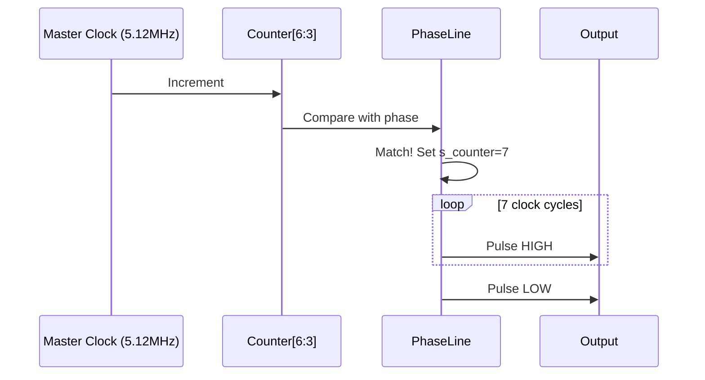
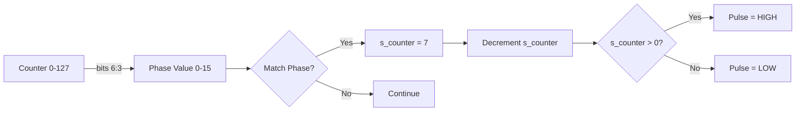

# Simple Solution: Use Mermaid Instead of WaveDrom

## The Problem

GitHub **does not natively support WaveDrom** rendering in markdown files. While we can generate SVG images, there's a simpler solution.

## The Solution: Use Mermaid

GitHub **DOES support Mermaid diagrams natively**! While Mermaid isn't perfect for timing diagrams, it can create useful visualizations.

---

## Mermaid for Timing Diagrams

### Option 1: Gantt Charts (Timeline View)

```mermaid
gantt
    title Counter and Phase Timing (25µs period)
    dateFormat X
    axisFormat %L
    section Counter[6:3]
    Phase 0 :0, 8
    Phase 1 :8, 8
    Phase 2 :16, 8
    Phase 3 :24, 8
    section Pulse
    Pulse HIGH :5, 7
```



### Option 2: Sequence Diagrams (Signal Flow)



### Option 3: Flowcharts (Logic Flow)



---

## Alternative: Embed Pre-Generated SVG Images

If you really want WaveDrom diagrams on GitHub:

### Step 1: Generate SVGs Manually

1. Go to https://wavedrom.com/editor.html
2. Paste your WaveDrom code
3. Click "Export SVG"
4. Save to `wavedrom-images/` folder

### Step 2: Reference in Markdown

```markdown

```

---

## Recommendation

**Use a hybrid approach:**

1. **Keep WaveDrom code blocks** - For editing and external viewing
2. **Add Mermaid diagrams** - For GitHub native rendering
3. **Manually export key diagrams** - As SVG for important visualizations

This gives you:
- ✅ GitHub-native rendering (Mermaid)
- ✅ Professional timing diagrams (WaveDrom SVG exports)
- ✅ Editable source (WaveDrom code blocks)

---

## Example: Hybrid Approach

````markdown
### Counter and Phase Timing

**Mermaid Diagram** (renders on GitHub):

```mermaid
gantt
    title 40kHz Counter (25µs period)
    dateFormat X
    axisFormat %L
    section Counter
    Phase 0-7 :0, 64
    Phase 8-15 :64, 64
```



**WaveDrom Code** (for editing):

```wavedrom
{
  signal: [
    {name: 'clk', wave: 'p......'},
    {name: 'counter[6:3]', wave: 'x2.3...', data: ['0','1']}
  ]
}
```

**High-Quality Diagram** (exported SVG):


````

---

## Next Steps

Would you like me to:

1. **Convert WaveDrom to Mermaid** - Create Mermaid equivalents for your diagrams?
2. **Manual SVG export guide** - Step-by-step instructions for exporting WaveDrom SVGs?
3. **Keep WaveDrom only** - For local/external viewing (VS Code, online editor)?

Let me know your preference!

