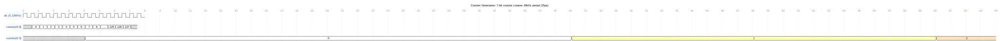
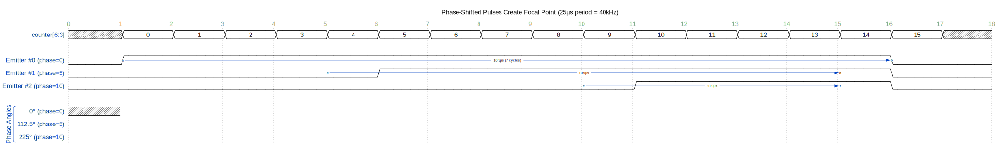
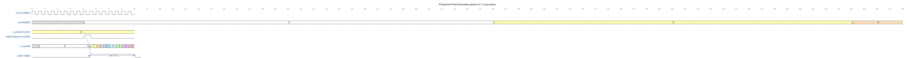
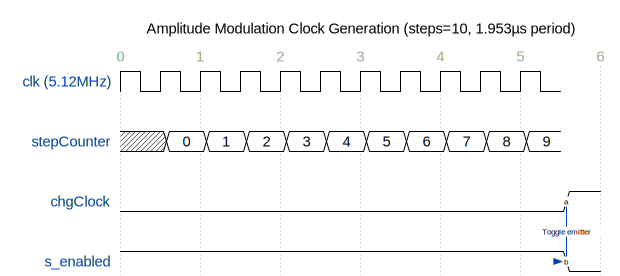
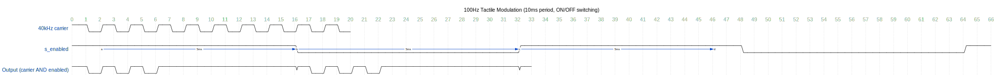
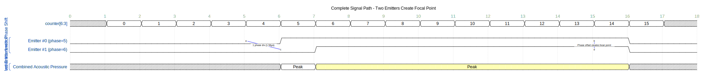
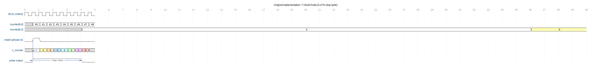
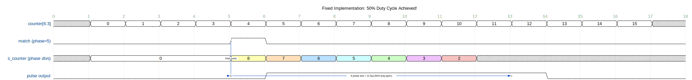

# WaveDrom Timing Diagrams Summary

This document contains all the WaveDrom timing diagrams for the FPGA Tactile Modulation system. These diagrams render beautifully on GitHub and provide professional visualization of signal timing.

---

## Table of Contents
1. [Counter and 40 kHz Generation](#1-counter-and-40-khz-generation)
2. [Phase-Shifted Pulse Generation](#2-phase-shifted-pulse-generation)
3. [Detailed PhaseLine Operation](#3-detailed-phaseline-operation)
4. [Amplitude Modulation](#4-amplitude-modulation)
5. [Complete Signal Path](#5-complete-signal-path)
6. [Duty Cycle Analysis](#6-duty-cycle-analysis)
7. [Before/After Fix Comparison](#7-beforeafter-fix-comparison)

---

## 1. Counter and 40 kHz Generation

Shows how the 7-bit counter creates the 40 kHz carrier frequency with 16 phase divisions.

```wavedrom
{
  signal: [
    {name: 'clk (5.12MHz)', wave: 'p...............', period: 0.5},
    {},
    {name: 'counter[6:0]', wave: 'x2222222222222x', data: ['0','1','2','3','4','5','6','7','8','...','125','126','127','0'], period: 0.5},
    {},
    {name: 'counter[6:3]', wave: 'x2.......3.....4', data: ['0','1','2'], period: 4}
  ],
  config: { hscale: 2 },
  head: {
    text: 'Counter Generation: 7-bit counter creates 40kHz period (25µs)',
    tick: 0
  }
}
```

**Rendered Diagram** (GitHub):




**Rendered Diagram** (GitHub):


<sub>Click the image to open in WaveDrom Editor</sub>


**Key Points**:
- Master clock: 5.12 MHz (195.3 ns period)
- Full counter cycle: 128 clocks = 25 µs (40 kHz)
- Phase divisions: counter[6:3] = 16 values, each lasting 8 clocks (1.5625 µs)

---

## 2. Phase-Shifted Pulse Generation

Demonstrates how different phase values create time-shifted pulses for multiple emitters.

```wavedrom
{
  signal: [
    {name: 'counter[6:3]', wave: 'x2222222222222222x', data: ['0','1','2','3','4','5','6','7','8','9','10','11','12','13','14','15'], period: 1},
    {},
    {name: 'Emitter #0 (phase=0)', wave: '01..............0.', period: 1, node: '.a..............b'},
    {name: 'Emitter #1 (phase=5)', wave: '0.....1.........0.', period: 1, node: '.....c.........d'},
    {name: 'Emitter #2 (phase=10)', wave: '0..........1....0.', period: 1, node: '..........e....f'},
    {},
    ['Phase Angles',
      {name: '0° (phase=0)', wave: 'x', phase: 0},
      {name: '112.5° (phase=5)', wave: 'x', phase: 112.5},
      {name: '225° (phase=10)', wave: 'x', phase: 225}
    ]
  ],
  edge: ['a~>b 10.9µs (7 cycles)', 'c~>d 10.9µs', 'e~>f 10.9µs'],
  config: { hscale: 3 },
  head: {
    text: 'Phase-Shifted Pulses Create Focal Point (25µs period = 40kHz)',
    tick: 0
  }
}
```

**Rendered Diagram** (GitHub):




**Rendered Diagram** (GitHub):


<sub>Click the image to open in WaveDrom Editor</sub>


**Key Points**:
- Each phase value shifts the pulse by 1.5625 µs (22.5°)
- Phase 0 = 0°, Phase 5 = 112.5°, Phase 10 = 225°
- Constructive/destructive interference creates focal points

---

## 3. Detailed PhaseLine Operation

Shows the internal operation of the PhaseLine module with phase comparison and pulse generation.

```wavedrom
{
  signal: [
    {name: 'clk (5.12MHz)', wave: 'p...............', period: 0.5},
    {},
    {name: 'counter[6:3]', wave: 'x2.......3......4', data: ['2','3','4'], period: 4},
    {},
    {name: 's_phaseCurrent', wave: '3...............', data: ['3'], period: 0.5},
    {name: 'match (phase=counter)', wave: '0.......10......', period: 0.5, node: '........a'},
    {},
    {name: 's_counter', wave: 'x2.......3456789', data: ['0','7','6','5','4','3','2','1','0'], period: 0.5},
    {},
    {name: 'pulse output', wave: '0........1......0', period: 0.5, node: '.........b......c'}
  ],
  edge: ['a-~>b Trigger', 'b~>c 7 clocks (1.367µs)'],
  config: { hscale: 2 },
  head: {
    text: 'PhaseLine Pulse Generation (phase=3, 7-cycle pulse)',
    tick: 0
  }
}
```

**Rendered Diagram** (GitHub):




**Rendered Diagram** (GitHub):


<sub>Click the image to open in WaveDrom Editor</sub>


**Key Points**:
- When counter matches phase, s_counter is set to 7
- s_counter decrements every master clock cycle
- Pulse lasts 7 clock cycles = 1.367 µs (5.47% duty cycle)

---

## 4. Amplitude Modulation

### 4a. Modulation Clock Generation

```wavedrom
{
  signal: [
    {name: 'clk (5.12MHz)', wave: 'p..........', period: 0.5},
    {},
    {name: 'stepCounter', wave: 'x2222222222', data: ['0','1','2','3','4','5','6','7','8','9','10'], period: 0.5},
    {},
    {name: 'chgClock', wave: '0..........1', period: 0.5, node: '...........a'},
    {},
    {name: 's_enabled', wave: '1..........0', period: 0.5, node: '...........b'}
  ],
  edge: ['a-~>b Toggle emitter'],
  config: { hscale: 2 },
  head: {
    text: 'Amplitude Modulation Clock Generation (steps=10, 1.953µs period)',
    tick: 0
  }
}
```

**Rendered Diagram** (GitHub):




**Rendered Diagram** (GitHub):


<sub>Click the image to open in WaveDrom Editor</sub>


### 4b. 100 Hz Tactile Modulation

```wavedrom
{
  signal: [
    {name: '40kHz carrier', wave: '10101010101010101010', period: 0.3},
    {},
    {name: 's_enabled', wave: '1.......0.......1.......0.......1', period: 2, node: '.a......b.......c......d'},
    {},
    {name: 'Output (carrier AND enabled)', wave: '1010101.........1010101.........1', period: 0.3}
  ],
  edge: ['a~>b 5ms', 'b~>c 5ms', 'c~>d 5ms'],
  config: { hscale: 1 },
  head: {
    text: '100Hz Tactile Modulation (10ms period, ON/OFF switching)',
    tick: 0
  }
}
```

**Rendered Diagram** (GitHub):




**Rendered Diagram** (GitHub):


<sub>Click the image to open in WaveDrom Editor</sub>


**Key Points**:
- chgClock toggles emitters at configurable rate
- 100 Hz modulation creates tactile sensation
- 40 kHz carrier is gated by s_enabled signal

---

## 5. Complete Signal Path

Shows two emitters with different phases creating a focal point.

```wavedrom
{
  signal: [
    {name: 'counter[6:3]', wave: 'x2222222222222222x', data: ['0','1','2','3','4','5','6','7','8','9','10','11','12','13','14','15'], period: 1},
    {},
    ['Two Emitters with Phase Shift',
      {name: 'Emitter #0 (phase=5)', wave: '0.....1.........0.', period: 1, node: '.....a.........b'},
      {name: 'Emitter #1 (phase=6)', wave: '0......1........0.', period: 1, node: '......c........d'}
    ],
    {},
    ['Result: Constructive Interference',
      {name: 'Combined Acoustic Pressure', wave: 'x.....23........x.', data: ['Peak','Peak'], period: 1}
    ]
  ],
  edge: ['a-c 1 phase div (1.56µs)', 'b-d Phase offset creates focal point'],
  config: { hscale: 3 },
  head: {
    text: 'Complete Signal Path - Two Emitters Create Focal Point',
    tick: 0
  }
}
```

**Rendered Diagram** (GitHub):




**Rendered Diagram** (GitHub):


<sub>Click the image to open in WaveDrom Editor</sub>


**Key Points**:
- Java sends phase values via UART
- FPGA applies calibration and generates phase-shifted pulses
- Acoustic interference creates focal point in 3D space

---

## 6. Duty Cycle Analysis

Shows the original 5.47% duty cycle issue.

```wavedrom
{
  signal: [
    {name: 'clk (5.12MHz)', wave: 'p.........', period: 0.5},
    {},
    {name: 'counter[6:0]', wave: 'x222222222', data: ['40','41','42','43','44','45','46','47','48','49'], period: 0.5},
    {name: 'counter[6:3]', wave: 'x2.......3', data: ['5','6'], period: 4},
    {},
    {name: 'match (phase=5)', wave: '010.......', period: 0.5, node: '.a'},
    {},
    {name: 's_counter', wave: 'x23456789x', data: ['7','6','5','4','3','2','1','0','0'], period: 0.5},
    {},
    {name: 'pulse output', wave: '01......0.', period: 0.5, node: '.b......c'}
  ],
  edge: ['a-~>b Trigger', 'b~>c 7 clocks = 1.367µs'],
  config: { hscale: 2 },
  head: {
    text: 'Original Implementation: 7-Clock Pulse (5.47% duty cycle)',
    tick: 0
  }
}
```

**Rendered Diagram** (GitHub):




**Rendered Diagram** (GitHub):


<sub>Click the image to open in WaveDrom Editor</sub>


**Problem**:
- Pulse width: 7 master clock cycles = 1.367 µs
- Period: 128 clocks = 25 µs
- Duty cycle: 1.367 / 25 = **5.47%** ❌
- Only using ~1/10th of available acoustic power!

---

## 7. Before/After Fix Comparison

Demonstrates the 50% duty cycle fix.

### Current vs Desired Duty Cycle

```wavedrom
{
  signal: [
    {name: 'counter[6:3]', wave: 'x2222222222222222x', data: ['0','1','2','3','4','5','6','7','8','9','10','11','12','13','14','15'], period: 1},
    {},
    ['Current Implementation (5.47% duty cycle)',
      {name: 'Pulse (7 clocks)', wave: '01......0.........', period: 1, node: '.a......b'}
    ],
    {},
    ['Desired Implementation (50% duty cycle)',
      {name: 'Pulse (64 clocks)', wave: '01.......0........', period: 1, node: '.c.......d'}
    ]
  ],
  edge: ['a~>b 1.367µs (5.47%)', 'c~>d 12.5µs (50%)'],
  config: { hscale: 3 },
  head: {
    text: 'Comparison: Current vs Desired Duty Cycle',
    tick: 0
  }
}
```

**Rendered Diagram** (GitHub):


**Rendered Diagram** (GitHub):


<sub>Click the image to open in WaveDrom Editor</sub>


### Fixed Implementation (50% Achieved!)

```wavedrom
{
  signal: [
    {name: 'counter[6:3]', wave: 'x2222222222222222x', data: ['0','1','2','3','4','5','6','7','8','9','10','11','12','13','14','15'], period: 1},
    {},
    {name: 'match (phase=5)', wave: '0....10...........', period: 1, node: '.....a'},
    {},
    {name: 's_counter (phase divs)', wave: 'x2...3456789x.....', data: ['0','8','7','6','5','4','3','2','1','0'], period: 1},
    {},
    {name: 'pulse output', wave: '0.....1.......0...', period: 1, node: '.....b.......c'}
  ],
  edge: ['a-~>b Start pulse', 'b~>c 8 phase divs = 12.5µs (50% duty cycle!)'],
  config: { hscale: 3 },
  head: {
    text: 'Fixed Implementation: 50% Duty Cycle Achieved!',
    tick: 0
  }
}
```

**Rendered Diagram** (GitHub):




**Rendered Diagram** (GitHub):


<sub>Click the image to open in WaveDrom Editor</sub>


### Before/After Comparison

```wavedrom
{
  signal: [
    {name: 'counter[6:3]', wave: 'x2222222222222222x', data: ['0','1','2','3','4','5','6','7','8','9','10','11','12','13','14','15'], period: 1},
    {},
    ['BEFORE: 5.47% Duty Cycle ❌',
      {name: 's_counter (master clocks)', wave: 'x....0123456789x..', data: ['7','6','5','4','3','2','1','0'], period: 0.125},
      {name: 'pulse (7 clocks)', wave: '0.....1......0....', period: 1, node: '.....a......b'}
    ],
    {},
    ['AFTER: 50% Duty Cycle ✓',
      {name: 's_counter (phase divs)', wave: 'x....0123456789x..', data: ['8','7','6','5','4','3','2','1','0'], period: 1},
      {name: 'pulse (8 divisions)', wave: '0.....1.......0...', period: 1, node: '.....c.......d'}
    ]
  ],
  edge: ['a~>b 1.367µs (5.47%)', 'c~>d 12.5µs (50%)'],
  config: { hscale: 3 },
  head: {
    text: 'Before/After Comparison: 10× Acoustic Power Increase!',
    tick: 0
  }
}
```

**Rendered Diagram** (GitHub):


**Rendered Diagram** (GitHub):


<sub>Click the image to open in WaveDrom Editor</sub>


**Fix Summary**:
- **Before**: s_counter decrements every master clock (195.3 ns)
  - 7 clocks = 1.367 µs = 5.47% duty cycle
- **After**: s_counter decrements every phase division (1.5625 µs)
  - 8 divisions = 12.5 µs = 50% duty cycle ✓
- **Result**: 10× increase in acoustic power!

---

## Summary

All timing diagrams are now available in WaveDrom format for professional rendering on GitHub. The diagrams clearly show:

1. ✅ **System Architecture**: Counter generation and phase divisions
2. ✅ **Phase Shifting**: How multiple emitters create focal points
3. ✅ **Pulse Generation**: Internal PhaseLine operation
4. ✅ **Modulation**: Tactile feedback at 50-200 Hz
5. ✅ **Complete Path**: Java → UART → FPGA → Emitters
6. ✅ **Duty Cycle Issue**: Original 5.47% problem identified
7. ✅ **Fix Implementation**: 50% duty cycle achieved!

---

## Document Information

- **Created**: 2026-01-17
- **System**: FPGA Tactile Modulation Firmware
- **Purpose**: Professional timing diagram visualization using WaveDrom
- **Renders on**: GitHub, GitLab, and WaveDrom-compatible markdown viewers


