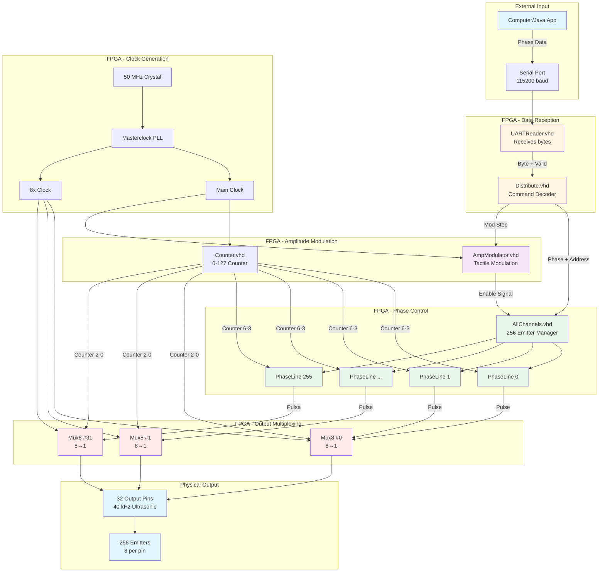

# FPGA Tactile Mode - Beginner's Guide

## Introduction

This guide explains the FPGA firmware structure for the **Tactile Modulation** mode, which is used to create tactile sensations using ultrasonic waves. The system controls 256 ultrasonic emitters at 40 kHz with amplitude modulation for tactile feedback.

---

## What is an FPGA?

An **FPGA (Field-Programmable Gate Array)** is a hardware chip that you can program to perform specific tasks. Unlike software running on a CPU:
- FPGAs execute operations **in parallel** (many things happen at the exact same time)
- FPGAs have **precise timing** down to nanoseconds
- FPGAs are perfect for controlling many outputs simultaneously (like 256 ultrasonic emitters)

The code is written in **VHDL** (VHSIC Hardware Description Language), which describes how digital circuits should behave.

---

## System Overview

### Architecture Diagram



### What Does This System Do?

The tactile FPGA firmware:
1. **Receives** phase data from a computer via UART (serial communication)
2. **Stores** phase information for 256 individual ultrasonic emitters
3. **Generates** 40 kHz ultrasonic pulses with precise phase delays
4. **Modulates** the amplitude to create tactile sensations (typically 50-200 Hz)
5. **Outputs** signals to 32 physical pins (using 8:1 multiplexing)

### Key Parameters
- **Ultrasonic Frequency**: 40 kHz (one wave cycle = 25 microseconds)
- **Phase Divisions**: 16 (each division = 1.5625 microseconds)
- **Number of Emitters**: 256
- **Physical Output Pins**: 32 (8 emitters share each pin via time-multiplexing)
- **Modulation**: Configurable for tactile feedback

---

## Main Files and Their Roles

### 1. **QuadrupleBuffer.bdf** - Top-Level Design
**Location**: `src/QuadrupleBuffer.bdf`  
**Type**: Block Diagram File (visual schematic)

This is the **main file** that connects all modules together. Think of it as the "blueprint" showing how all components are wired.

**Key connections**:
- Clock generation (PLL)
- UART input
- All processing modules
- Output pins

### 2. **UARTReader.vhd** - Serial Communication Input
**Location**: `src/UARTReader.vhd`  
**Purpose**: Receives data from the computer

**How it works**:
```
Computer → Serial Port (115200 baud) → UART → FPGA
```

**Key concepts**:
- **Baud rate**: 115200 bits per second
- **State machine**: Waits for start bit → reads 8 data bits → reads stop bit
- **Output**: One byte at a time with a "data valid" signal

**Important signals**:
- `i_RX_Serial`: Incoming serial data line
- `o_RX_DV`: "Data Valid" - pulses high when a byte is ready
- `o_RX_Byte`: The received byte (8 bits)

### 3. **Distribute.vhd** - Command Decoder
**Location**: `src/Distribute.vhd`  
**Purpose**: Interprets incoming bytes and routes them to the right place

**Command protocol**:
- `254 (0xFE)`: Start of phase data
- `253 (0xFD)`: Swap buffers (apply new phase data)
- `101XXXXX`: Set amplitude modulation step (5-bit value)
- Other bytes: Phase values for emitters (0-15 = phase, 32 = off)

**Key feature - Phase Calibration**:
```vhdl
constant PHASE_CORRECTION : T_PHASE_CORRECTION := (11,5,6,5,13,14,13,13,...)
```
This array corrects for physical differences in each emitter.

### 4. **PhaseLine.vhd** - Individual Emitter Controller
**Location**: `src/PhaseLine.vhd`  
**Purpose**: Controls ONE ultrasonic emitter (256 instances of this module exist)

**How it works**:
1. Stores a phase value (0-15, or 16+ for "off")
2. Watches a counter that cycles 0→15 repeatedly
3. When counter matches the stored phase, starts outputting a pulse
4. Pulse lasts for 8 phase divisions (50% duty cycle)

**Key code**:
```vhdl
if (s_phaseCurrent = to_integer(unsigned(counter))) then
    s_counter <= 8;  -- Start 8-division pulse
end if
```

**Double buffering**:
- `s_phaseCurrent`: Currently active phase
- `s_phasePrev`: Next phase (waiting for swap command)
- When swap signal arrives, they exchange values

### 5. **AllChannels.vhd** - Emitter Array Manager
**Location**: `src/AllChannels.vhd`  
**Purpose**: Manages all 256 PhaseLine instances

**Structure**:
```vhdl
generic(NBLOCKS: integer := 256);  -- 256 emitters
```

**Important detail**:
```vhdl
phase => phase(5 downto 1),  -- Uses bits 5-1 (not 4-0!)
```
This is why the Java software sends phase values that look shifted.

**Generates**:
- 256 PhaseLine instances (one per emitter)
- 32 Mux8 instances (for multiplexing)

### 6. **Mux8.vhd** - 8-to-1 Multiplexer
**Location**: `src/Mux8.vhd`
**Purpose**: Combines 8 emitter signals into 1 output pin

**Why multiplexing?**
- 256 emitters but only 32 physical output pins
- Each pin connects to 8 emitters
- Only one emitter per group is active at any moment

**How it works**:
```vhdl
data_out <= data_in(to_integer(unsigned(sel)));
```
The `sel` signal (0-7) chooses which of the 8 inputs to output.

**Timing**: The selector cycles through 0→7 very fast, so each emitter gets its turn.

### 7. **AmpModulator.vhd** - Amplitude Modulation
**Location**: `src/AmpModulator.vhd`
**Purpose**: Creates the tactile sensation by modulating amplitude

**How it works**:
1. Counts from 0 to 255 repeatedly
2. Speed controlled by `steps` input (from Distribute module)
3. Outputs current amplitude value (0-255)
4. Generates `chgClock` signal to update which emitters are enabled

**Key concept**:
- Lower `steps` value = faster modulation = higher frequency tactile sensation
- Higher `steps` value = slower modulation = lower frequency tactile sensation

**Code**:
```vhdl
if (s_stepCounter = to_integer(unsigned(steps))) then
    s_stepCounter <= 0;
    s_amp <= std_logic_vector(to_unsigned(s_counter, 8));
    s_counter <= s_counter + 1;  -- Increment amplitude
end if
```

### 8. **Counter.vhd** - Master Timing Counter
**Location**: `src/Counter.vhd`
**Purpose**: Generates the main timing reference (0-127 counter)

This counter is divided into sections:
- **Bits 6-3**: Phase counter (0-15) - determines which phase division we're in
- **Bits 2-0**: Mux selector (0-7) - determines which emitter in a group is active

### 9. **LatchBuffer.vhd** - Signal Synchronization
**Location**: `src/LatchBuffer.vhd`
**Purpose**: Ensures clean signal transitions

Prevents glitches by latching (holding) signals stable on clock edges.

### 10. **Masterclock.qip** - PLL Clock Generator
**Location**: `src/Masterclock.qip`
**Purpose**: Generates high-speed clocks from 50 MHz input

**Clocks generated**:
- Main clock for logic
- 8x clock for multiplexing
- Other timing signals

---

## How Data Flows Through the System

### Step-by-Step Process

```
1. Computer (Java) → UART (115200 baud)
   Sends: [254] [phase0] [phase1] ... [phase255] [253]

2. UARTReader.vhd
   Receives bytes one at a time
   Outputs: byte + "data valid" signal

3. Distribute.vhd
   Decodes commands:
   - 254 → "Start receiving phases"
   - 0-31 → Phase value (with calibration correction)
   - 253 → "Swap buffers"
   - 101XXXXX → "Set modulation speed"

4. AllChannels.vhd
   Routes phase data to correct PhaseLine instance
   Address 0-255 selects which emitter

5. PhaseLine.vhd (×256 instances)
   Each stores its phase value
   Waits for counter to match phase
   Outputs pulse when matched

6. Mux8.vhd (×32 instances)
   Combines 8 PhaseLine outputs
   Selects one based on counter bits 2-0

7. Output Pins (32 pins)
   Drive ultrasonic emitters
   40 kHz pulses with precise phase delays

8. AmpModulator.vhd
   Modulates which emitters are enabled
   Creates tactile sensation (50-200 Hz)
```

---

## Understanding VHDL Code Basics

### Key Concepts for Beginners

#### 1. **Entity** - The Interface
```vhdl
entity PhaseLine is
    port (
        clk : in  STD_LOGIC;           -- Input: clock
        phase : in STD_LOGIC_VECTOR(4 downto 0);  -- Input: 5-bit phase
        pulse : out STD_LOGIC          -- Output: pulse signal
    );
end PhaseLine;
```
Think of this as the "function signature" - it defines inputs and outputs.

#### 2. **Architecture** - The Implementation
```vhdl
architecture Behavioral of PhaseLine is
    -- Internal signals (like local variables)
    signal s_counter : integer range 0 to 8 := 0;
begin
    -- Processes (like functions that run on events)
end Behavioral;
```

#### 3. **Process** - Event-Driven Code
```vhdl
process (clk) begin
    if (rising_edge(clk)) then
        -- This code runs on every clock rising edge
        s_counter <= s_counter + 1;
    end if;
end process;
```
**Important**: `<=` is signal assignment (happens after the process completes).

#### 4. **Signals vs Variables**
- **Signals**: Like wires connecting components (use `<=`)
- **Variables**: Temporary values inside processes (use `:=`)

#### 5. **STD_LOGIC_VECTOR** - Bit Arrays
```vhdl
signal phase : STD_LOGIC_VECTOR(4 downto 0);  -- 5 bits: phase(4), phase(3), ..., phase(0)
```
- `(4 downto 0)` means bit 4 is most significant, bit 0 is least significant
- `phase(5 downto 1)` means bits 5,4,3,2,1 (skipping bit 0)

#### 6. **Generate Statements** - Creating Multiple Instances
```vhdl
insts : for i in 0 to (NBLOCKS-1) generate
    PhaseLine_inst : PhaseLine PORT MAP (
        clk => clk,
        phase => phase(5 downto 1),
        pulse => s_pulseToMux(i)
    );
end generate insts;
```
This creates 256 copies of PhaseLine, like a for-loop creating objects.

---

## Timing and Synchronization

### Clock Hierarchy

```
50 MHz Crystal Oscillator
    ↓
Masterclock (PLL)
    ↓
├─ clk (main clock for logic)
├─ clk8 (8× faster for multiplexing)
└─ chgClock (from AmpModulator for amplitude changes)
```

### Why Multiple Clocks?

- **Main clock**: Runs all the logic (counters, phase comparisons)
- **clk8**: Runs 8× faster to handle multiplexing quickly
- **chgClock**: Triggers amplitude updates at modulation frequency

### Synchronization is Critical

In FPGAs, all signals must be synchronized to clock edges to avoid:
- **Metastability**: Unpredictable behavior when signals change at wrong times
- **Race conditions**: Different parts of circuit updating in wrong order

This is why you see:
```vhdl
if (rising_edge(clk)) then
    -- All updates happen together on clock edge
end if
```

---

## Key Differences: Tactile vs Primary Firmware

| Feature | Primary Firmware | Tactile Firmware |
|---------|-----------------|------------------|
| **Phase Divisions** | 32 | 16 |
| **Phase Bits Used** | `phase(4 downto 0)` | `phase(5 downto 1)` |
| **Amplitude Modulation** | No | Yes (AmpModulator.vhd) |
| **Use Case** | Mid-air haptics | Tactile feedback |
| **Modulation** | Static | Dynamic (50-200 Hz) |

The tactile firmware trades phase resolution (16 vs 32) for amplitude modulation capability.

---

## Common Patterns in This Code

### 1. **Double Buffering**
```vhdl
signal s_phaseCurrent : integer;
signal s_phasePrev : integer;

-- Load new value
if (set = '1') then
    s_phasePrev <= new_phase;
end if

-- Swap buffers
if (swap = '1') then
    s_phaseCurrent <= s_phasePrev;
end if
```
**Why?** Allows loading new data while current data is still being used.

### 2. **Edge Detection**
```vhdl
signal s_prevSet : std_logic := '0';

if (set = '1' AND s_prevSet = '0') then
    -- Rising edge detected!
end if
s_prevSet <= set;
```
**Why?** Detects when a signal transitions from 0→1 (rising edge).

### 3. **State Machines**
```vhdl
type t_SM_Main is (s_Idle, s_RX_Start_Bit, s_RX_Data_Bits, s_RX_Stop_Bit);
signal r_SM_Main : t_SM_Main := s_Idle;

case r_SM_Main is
    when s_Idle =>
        -- Wait for start
    when s_RX_Data_Bits =>
        -- Receive data
end case;
```
**Why?** Manages complex sequences of operations.

---

## File Types Explained

### VHDL Files (.vhd)
- **Source code** written in VHDL
- Describes behavior of digital circuits
- Human-readable and editable

### Block Diagram Files (.bdf)
- **Visual schematic** showing connections
- Created in Quartus (Intel's FPGA tool)
- Shows how modules connect together

### Include Files (.inc)
- **Component declarations** for use in other files
- Auto-generated by Quartus
- Allows one module to use another

### Quartus Project Files
- **.qpf**: Project file
- **.qsf**: Settings file (pin assignments, device selection)
- **.qip**: IP core file (like Masterclock PLL)

### Compiled Output
- **.jic**: JTAG Indirect Configuration file
- This is what you program into the FPGA

---

## How to Read the Code

### Start Here (Recommended Order):

1. **QuadrupleBuffer.bdf** - See the big picture (visual)
2. **UARTReader.vhd** - Understand how data enters
3. **Distribute.vhd** - See how commands are decoded
4. **PhaseLine.vhd** - Understand one emitter's behavior
5. **AllChannels.vhd** - See how 256 emitters are managed
6. **Mux8.vhd** - Understand multiplexing
7. **AmpModulator.vhd** - See how tactile modulation works

### When Reading VHDL:

1. **Start with the entity** - What are inputs/outputs?
2. **Look at signals** - What internal wires exist?
3. **Find the processes** - What happens on clock edges?
4. **Trace data flow** - How does input become output?

---

## Practical Example: Sending Phase Data

### From Java Application:
```java
// Send start command
serial.write(254);

// Send phase for each of 256 emitters
for (int i = 0; i < 256; i++) {
    int phase = calculatePhase(i);  // 0-15
    serial.write(phase);
}

// Send swap command to apply changes
serial.write(253);
```

### In FPGA (Distribute.vhd):
```vhdl
if (q_in = "11111110") then      -- 254: Start
    s_ByteCounter <= 0;
elsif (q_in = "11111101") then   -- 253: Swap
    s_swap_out <= '1';
else                              -- Phase data
    s_address <= s_ByteCounter;   -- Which emitter (0-255)
    s_data_out <= q_in + PHASE_CORRECTION(s_ByteCounter);
    s_set_out <= '1';             -- Tell PhaseLine to store it
end if;
```

### In PhaseLine.vhd:
```vhdl
if (set = '1' AND s_prevSet = '0') then
    s_phasePrev <= to_integer(unsigned(phase));  -- Store in buffer
end if

if (swap = '1' AND s_prevSwap = '0') then
    s_phaseCurrent <= s_phasePrev;  -- Activate new phase
end if
```

---

## Summary

### What You've Learned:

1. **FPGA basics**: Parallel hardware, precise timing, VHDL language
2. **System architecture**: UART → Distribute → PhaseLine → Mux → Output
3. **Key modules**: UARTReader, Distribute, PhaseLine, AllChannels, Mux8, AmpModulator
4. **VHDL concepts**: Entities, processes, signals, clocks, edge detection
5. **Data flow**: How phase data travels from computer to ultrasonic emitters
6. **Tactile modulation**: How amplitude modulation creates tactile sensations

### Next Steps:

- Open **QuadrupleBuffer.bdf** in Quartus to see the visual schematic
- Read through **PhaseLine.vhd** line by line with this guide
- Experiment with changing **AmpModulator** step values in the Java application
- Study the existing documentation in `PHASE_SIGNAL_PATH_DOCUMENTATION.md`

### Key Takeaway:

The tactile FPGA firmware is a **real-time control system** that:
- Receives phase commands via serial
- Stores them in 256 parallel controllers
- Generates precisely timed 40 kHz pulses
- Modulates amplitude for tactile feedback
- All synchronized to nanosecond precision!

---

## Additional Resources

- **PHASE_SIGNAL_PATH_DOCUMENTATION.md** - Detailed signal path analysis
- **NUMERICAL_VERIFICATION.md** - Timing calculations and examples
- **DUTY_CYCLE_CORRECTION.md** - Pulse width adjustments
- **MUX8_ANALYSIS.md** - Multiplexing details

Good luck with your FPGA journey! 🚀


